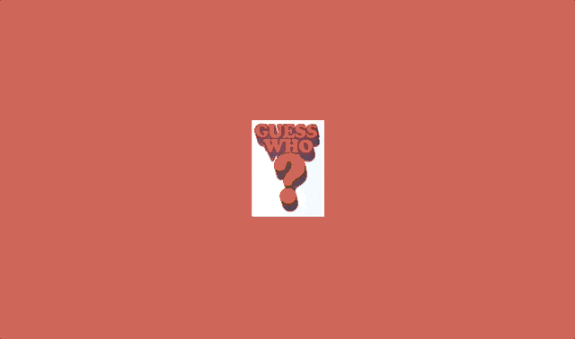

<div align="center">
  <br /><br /><br /><br />
  
</div>

# yubaba

✨ Element to element animation orchestrator for React.js

[](https://travis-ci.org/madou/yubaba)
[](https://codecov.io/gh/madou/yubaba)
[](https://david-dm.org/madou/yubaba)
[](https://david-dm.org/madou/yubaba?type=dev)

[](https://madou.github.io/yubaba/?selectedKind=Examples%2FGoogleMusic&selectedStory=move%20expand%20shrink%20wait&full=0&addons=0&stories=1&panelRight=0)

## Installation

```bash
yarn add yubaba
```

## Motivation

Beautiful page transitions are becoming more common on the web but we're still at apoint where we need to write a lot of boilerplate to make it happen,
and worse yet different parts of our apps needing to know about each other to make it all work.

What if we could keep writing our apps as we do today,
have no leaky abstractions,
and have beautiful transitions easily?

## Examples

`yubaba`'s purpose is orchestration,
and that is the key.
Orchestrating when animations should execute,
and when content should be displayed, are the bread and butter of `yubaba`.

These examples will build up from each other to eventually leave you with a fully fledged page transition.

### Move

Ok so we have two disjointed components on two different pages.
Let's use `yubaba` to have them seamlessly transition to each other.

```javascript
import Baba, { Move } from 'yubaba';
```

[](https://madou.github.io/yubaba)

* The component switching happens immediately as usual,
  hence why the background color changes immediately from red to blue.
  We'll improve this in a few steps.

### Circle expand _and_ move

Ok so they can move to each other, cool.
But it's not looking as sweet as it could be!
Let's introduce another animation, `CircleExpand`.

```javascript
import Baba, { Move, CircleExpand } from 'yubaba';
```

[](https://madou.github.io/yubaba)

### Circle expand _then_ move

OK so it's all looking sweet,
but I think it'd look even sweeter if the `Move` happened after the `CircleExpand`,
don't you?
Lets introduce an animation helper `Wait` to do just that.

```javascript
import Baba, { Move, CircleExpand, Wait } from 'yubaba';
```

[](https://madou.github.io/yubaba)

### Circle expand _then_ move _then_ show contents

Ok so there's one more finishing touch that would really seal the deal,
and that's not showing the new page contents until after all animations have finished.
Let's introduce an animation helper `BabaManager` to do just that.

```javascript
import Baba, { Move, CircleExpand, Wait, BabaManager } from 'yubaba';
```

* The background now doesn't change immediately thanks to the `BabaManager`
* The `BabaManager` will provider style props which we can then pass to one or more components
  we want to stay hidden until the animations have finished
* Remember this is all just CSS - we could also add a `transition` to said components to fade them in.

[](https://madou.github.io/yubaba)

### Putting it altogether

Ok so we have an awesome animation in one direction,
but we can have our cake and eat it too!
Let's introduce `CircleShrink` and have our two-way transition happening.

```javascript
import Baba, { Move, CircleExpand, Wait, BabaManager, CircleShrink } from 'yubaba';
```

[](https://madou.github.io/yubaba)

## Other Examples

There are many examples in our [storybook](https://madou.github.io/yubaba/?selectedKind=Examples%2FGoogleSearch&selectedStory=search%20bar&full=0&addons=0&stories=1&panelRight=0), top picks would include the Google Music and Mobile Google Image Search examples.

## Built-in Animations

Section coming soon.

### Make your own

Section coming soon.

## API Docs

Section coming soon.
